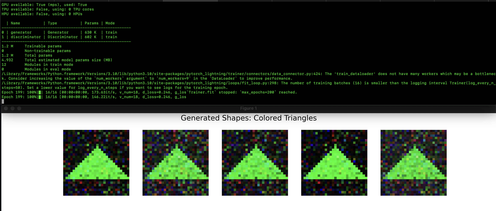

# learning-GAN



# Unleashing Creativity with GANs

Generative Adversarial Networks (GANs) have revolutionized the field of artificial intelligence by enabling machines to create realistic data that mirrors human creativity. From generating lifelike images to composing music, GANs are at the forefront of AI-driven content creation. In this blog post, we'll delve into the fundamentals of GANs by building one from scratch using PyTorch and PyTorch Lightning. Our GAN will learn to generate colorful triangles, showcasing the power and simplicity of this technology.

## Table of Contents

1. [What Are GANs?](#what-are-gans)
2. [Setting Up the Environment](#setting-up-the-environment)
3. [Creating a Dataset of Colored Triangles](#creating-a-dataset-of-colored-triangles)
4. [Building the Generator and Discriminator](#building-the-generator-and-discriminator)
5. [Training the GAN](#training-the-gan)
6. [Generating and Visualizing Images](#generating-and-visualizing-images)
7. [Understanding GANs Through Our Example](#understanding-gans-through-our-example)
8. [Conclusion](#conclusion)

---

## What Are GANs?

Generative Adversarial Networks (GANs) are a class of machine learning frameworks designed by Ian Goodfellow and his colleagues in 2014. GANs consist of two neural networks: a **Generator** and a **Discriminator**. These networks engage in a game-theoretic battle where:

- **Generator**: Creates fake data (e.g., images) from random noise.
- **Discriminator**: Evaluates data to distinguish between real (from the dataset) and fake (from the generator).

Through this adversarial process, both networks improve over time—the generator becomes better at creating realistic data, and the discriminator becomes better at detecting fakes. This tug-of-war leads to the generator producing highly realistic data after sufficient training.

## Setting Up the Environment

Before diving into the code, ensure you have the necessary libraries installed. We'll be using:

- **PyTorch**: A powerful deep learning framework.
- **PyTorch Lightning**: A lightweight wrapper for PyTorch that simplifies training.
- **Matplotlib**: For visualizing generated images.
- **NumPy**: For numerical operations.

You can install these libraries using `pip`:

```bash
pip install torch pytorch-lightning matplotlib numpy
```

## Creating a Dataset of Colored Triangles

For our GAN to learn, it needs data. We'll create a synthetic dataset of colored triangles. This approach allows us to have full control over the data and ensures simplicity, making it easier to understand the GAN's training process.

```python
import torch
from torch.utils.data import DataLoader, TensorDataset
import numpy as np

# Hyperparameters
BATCH_SIZE = 64
IMG_SIZE = 28

# Data Preparation (Generating simple shapes: colored triangles)
def generate_colored_triangles_dataset(num_samples=1000, img_size=IMG_SIZE):
    data = []
    labels = []
    for _ in range(num_samples):
        image = np.zeros((3, img_size, img_size))  # RGB channels
        color = np.random.choice(['red', 'green', 'blue'])
        for i in range(img_size // 4, 3 * img_size // 4):
            image[:, i, img_size // 2 - (i - img_size // 4):img_size // 2 + (i - img_size // 4) + 1] = 1.0

        if color == 'red':
            image[1:, :, :] = 0  # Only red channel is active
        elif color == 'green':
            image[0, :, :] = 0  # Only green channel is active
            image[2, :, :] = 0
        elif color == 'blue':
            image[:2, :, :] = 0  # Only blue channel is active

        # Normalize the image to be between -1 and 1
        image = (image * 2) - 1

        data.append(image.flatten())
        labels.append(0)  # Since we're only generating triangles, all labels are 0

    data = np.array(data, dtype=np.float32)
    return torch.tensor(data)

data = generate_colored_triangles_dataset()
dataset = TensorDataset(data)
dataloader = DataLoader(dataset, batch_size=BATCH_SIZE, shuffle=True)
```

### How It Works

1. **Image Initialization**: We create an empty RGB image of size 28x28 pixels.
2. **Color Selection**: Randomly choose a color—red, green, or blue.
3. **Triangle Drawing**: Populate the image array to form a triangle shape.
4. **Color Assignment**: Activate only the chosen color channel.
5. **Normalization**: Scale pixel values to range between -1 and 1, which is beneficial for GAN training.
6. **Dataset Creation**: Flatten the images and create a PyTorch `DataLoader` for batch processing.

## Building the Generator and Discriminator

### The Generator

The generator's role is to produce fake images that resemble real triangles. It takes random noise as input and transforms it into a colored triangle.

```python
from torch import nn

# Generator Model
class Generator(nn.Module):
    def __init__(self, latent_dim):
        super().__init__()
        self.model = nn.Sequential(
            nn.Linear(latent_dim, 256),
            nn.ReLU(),
            nn.Linear(256, IMG_SIZE * IMG_SIZE * 3),  # Output for RGB image
            nn.Tanh()
        )

    def forward(self, z):
        return self.model(z).view(-1, 3, IMG_SIZE, IMG_SIZE)
```

### The Discriminator

The discriminator's job is to distinguish between real images (from our dataset) and fake images (from the generator).

```python
# Discriminator Model
class Discriminator(nn.Module):
    def __init__(self):
        super().__init__()
        self.model = nn.Sequential(
            nn.Linear(IMG_SIZE * IMG_SIZE * 3, 256),
            nn.ReLU(),
            nn.Linear(256, 1),
            nn.Sigmoid()
        )

    def forward(self, x):
        x = x.view(x.size(0), -1)
        return self.model(x)
```

### Understanding the Architecture

- **Generator**:
  - **Input**: A latent vector (`z`) of size 100 (random noise).
  - **Layers**:
    - `Linear`: Transforms the latent vector to 256 dimensions.
    - `ReLU`: Activation function introducing non-linearity.
    - `Linear`: Expands to the size needed for a 28x28 RGB image.
    - `Tanh`: Scales output to [-1, 1], matching our data normalization.
  - **Output**: A 3-channel (RGB) image reshaped to 28x28 pixels.

- **Discriminator**:
  - **Input**: A flattened image (3 x 28 x 28 = 2352 dimensions).
  - **Layers**:
    - `Linear`: Reduces to 256 dimensions.
    - `ReLU`: Activation function.
    - `Linear`: Outputs a single value.
    - `Sigmoid`: Converts the output to a probability between 0 and 1.
  - **Output**: Probability indicating whether the image is real (1) or fake (0).

## Training the GAN

Training a GAN involves iteratively updating both the generator and discriminator. We'll use PyTorch Lightning to streamline the training process.

```python
import pytorch_lightning as pl

# GAN Lightning Module
class GAN(pl.LightningModule):
    def __init__(self, latent_dim):
        super().__init__()
        self.generator = Generator(latent_dim)
        self.discriminator = Discriminator()
        self.latent_dim = latent_dim
        self.automatic_optimization = False  # We'll handle optimizers manually

    def forward(self, z):
        return self.generator(z)

    def training_step(self, batch, batch_idx):
        real_data = batch[0].to(self.device)
        batch_size = real_data.size(0)

        # Sample noise and generate fake data
        z = torch.randn(batch_size, self.latent_dim, device=self.device)
        fake_data = self(z)

        # Get optimizers
        d_optimizer, g_optimizer = self.optimizers()

        # Train discriminator
        d_optimizer.zero_grad()
        real_preds = self.discriminator(real_data)
        fake_preds = self.discriminator(fake_data.detach())
        real_loss = nn.functional.binary_cross_entropy(real_preds, torch.ones_like(real_preds))
        fake_loss = nn.functional.binary_cross_entropy(fake_preds, torch.zeros_like(fake_preds))
        d_loss = (real_loss + fake_loss) / 2
        self.manual_backward(d_loss)
        d_optimizer.step()
        self.log("d_loss", d_loss, prog_bar=True)

        # Train generator
        g_optimizer.zero_grad()
        fake_preds = self.discriminator(fake_data)
        g_loss = nn.functional.binary_cross_entropy(fake_preds, torch.ones_like(fake_preds))
        self.manual_backward(g_loss)
        g_optimizer.step()
        self.log("g_loss", g_loss, prog_bar=True)

    def configure_optimizers(self):
        lr = 0.0002
        d_optimizer = torch.optim.Adam(self.discriminator.parameters(), lr=lr)
        g_optimizer = torch.optim.Adam(self.generator.parameters(), lr=lr)
        return [d_optimizer, g_optimizer]
```

### Breaking Down the Training Process

1. **Initialization**:
   - Instantiate the generator and discriminator.
   - Set `automatic_optimization` to `False` to manually control the optimization steps.

2. **Forward Pass**:
   - The generator creates fake data from random noise.

3. **Discriminator Training**:
   - **Real Data**: Pass real images through the discriminator and calculate loss against labels `1` (real).
   - **Fake Data**: Pass generated images (detached from the generator to prevent gradient flow) through the discriminator and calculate loss against labels `0` (fake).
   - **Total Discriminator Loss**: Average of real and fake losses.
   - **Backward Pass & Optimization**: Update discriminator weights to better distinguish real from fake.

4. **Generator Training**:
   - Pass generated images through the discriminator.
   - Calculate loss against labels `1` because the generator aims to fool the discriminator.
   - **Backward Pass & Optimization**: Update generator weights to produce more realistic images.

5. **Logging**:
   - Track both discriminator and generator losses for monitoring.

### Training the Model

With the GAN defined, let's proceed to train it.

```python
# Hyperparameters
LATENT_DIM = 100
EPOCHS = 200

# Training the GAN
model = GAN(latent_dim=LATENT_DIM)
trainer = pl.Trainer(max_epochs=EPOCHS)
trainer.fit(model, dataloader)
```

**Training Tips**:

- **Epochs**: The number of passes through the entire dataset. More epochs allow the GAN to learn better but can lead to overfitting.
- **Learning Rate**: Set to `0.0002` for stable training.
- **Batch Size**: Larger batches provide more stable gradients but require more memory.

## Generating and Visualizing Images

After training, it's time to see the GAN in action by generating new images.

```python
import matplotlib.pyplot as plt

# Generate and visualize an image
def generate_image(model, latent_dim, num_images=5):
    model.eval()
    fig, axes = plt.subplots(1, num_images, figsize=(15, 3))
    for i in range(num_images):
        z = torch.randn(1, latent_dim)
        with torch.no_grad():
            generated_image = model.generator(z).squeeze().cpu().numpy()
            generated_image = np.transpose(generated_image, (1, 2, 0))  # Convert to HxWxC
        axes[i].imshow((generated_image + 1) / 2)  # Rescale to [0, 1] for visualization
        axes[i].axis('off')
    plt.suptitle("Generated Shapes: Colored Triangles", fontsize=16)
    plt.show()

# Generate multiple images using the trained generator
generate_image(model, LATENT_DIM)
```

### Visualizing the Results

The `generate_image` function creates new images by:

1. Sampling random noise vectors.
2. Passing them through the trained generator to produce images.
3. Rescaling the pixel values back to the `[0, 1]` range for visualization.
4. Displaying the images using Matplotlib.

**Sample Output**:


Each generated image should resemble a colored triangle, potentially varying in color and slight shape nuances due to the randomness in noise input.

## Understanding GANs Through Our Example

Let's break down what happens during and after training:

1. **Adversarial Training**:
   - The generator and discriminator are locked in a two-player game.
   - The generator tries to create images that can fool the discriminator.
   - The discriminator strives to accurately identify real versus fake images.

2. **Learning Process**:
   - Initially, the generator produces random noise, and the discriminator easily distinguishes it from real images.
   - As training progresses, the generator improves, producing more realistic triangles.
   - Simultaneously, the discriminator becomes more adept at identifying subtle differences between real and generated images.

3. **Resulting Images**:
   - After sufficient training, the generator can produce convincing colored triangles that the discriminator finds challenging to differentiate from real ones.
   - While there might still be imperfections, the generated images showcase the GAN's ability to learn and replicate the underlying data distribution.

4. **Color Variations**:
   - By introducing color variations (red, green, blue), we added complexity to the dataset.
   - The generator learned to handle this diversity, producing triangles in various colors, demonstrating GANs' capability to capture multiple attributes simultaneously.

## Conclusion

Generative Adversarial Networks are a testament to the power of adversarial training in machine learning. By pitting two neural networks against each other, GANs can produce remarkably realistic data across various domains. In this blog post, we built a simple GAN to generate colorful triangles, unraveling the core concepts and mechanics behind this groundbreaking technology.

Whether you're a seasoned AI practitioner or a curious enthusiast, understanding GANs opens doors to endless creative possibilities. From art and design to data augmentation and beyond, GANs are poised to redefine how we approach and interact with generative tasks in the digital age.
